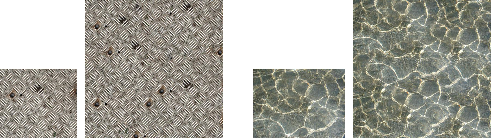
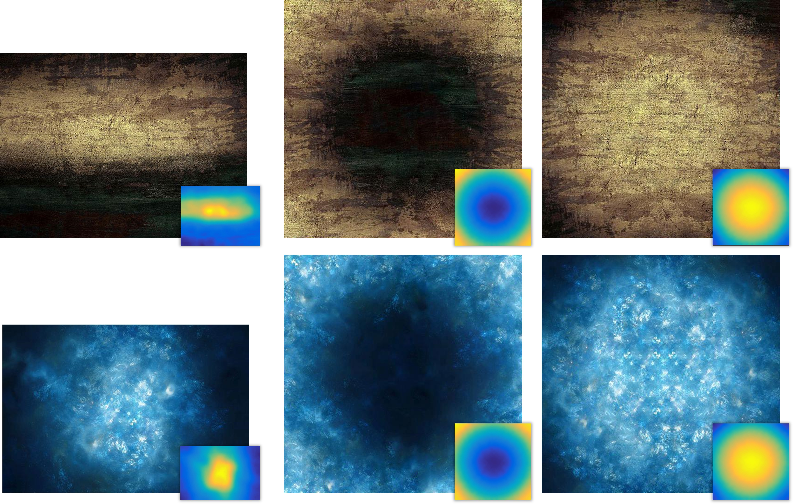
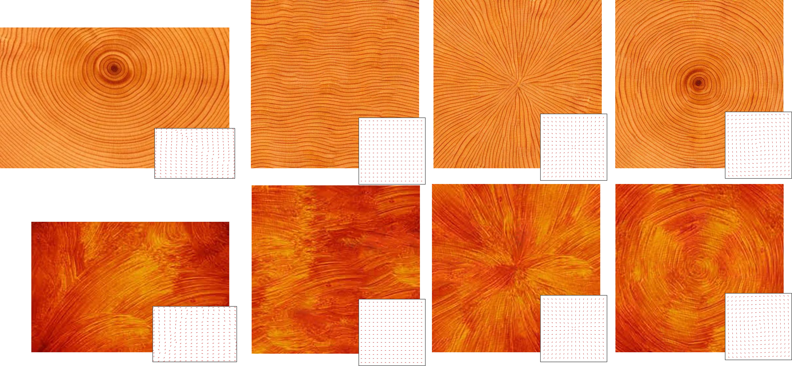
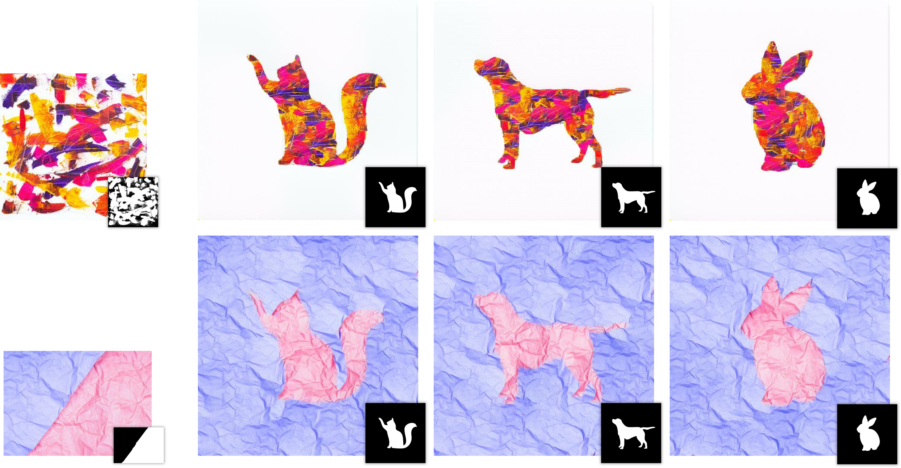

# Neural Texture Synthesis with Guided Correspondence - PyTorch version

> Notice: Still reorganizing and testing codes... Feel free to contact me if something not work.

Official PyTorch implementation of "[Neural Texture Synthesis with Guided Correspondence](https://vcc.tech/research/2023/DeepTex)" [CVPR 2023]. More result can be seen [here](https://eliotchenkj.github.io/Guided-Correspondence-Loss-Sup/).  
  


<!--
If you use this code for your research, please cite our paper:
```Bibtex
@article{DeepTex,
title = {Neural Texture Synthesis with Guided Correspondence},
author = {Yang Zhou and Kaijian Chen and Rongjun Xiao and Hui Huang*},
journal = {Conference on Computer Vision and Pattern Recognition (Proceedings of CVPR)},
volume = {},
number = {},
pages = {},
year = {2023},
}
```
-->

## Prerequisites
* Python 3.7.10
* PyTorch 1.9.0

## Texture Expansion
Synthesize texture with arbitrary size from exemplar texture:
  


```bash
python texturegen.py --data_folder=./data/stationary --output_folder=./outputs/result_synthesis --image_name=11.jpg --size=256 --output_size=512 512 --base_iters=500 --finetune_iters=0
```

## Controlled Texture Synthesis
Synthesize texture based on progression, orientation, both or label:
## 1. Progression Control
  


```bash
python texturegen_aug.py --data_folder=./data/progression --output_folder=./outputs/result_progression --image_name=6.jpg --refer_prog_name=6_prog.png --trg_prog_name=1_prog.png --lambda_progression=50 --lambda_occurrence=0.05 --output_size=512 512 --scales=0.25 0.5 0.75 1 --use_flip
```

## 2. Orientation Control
  


```bash
python texturegen_aug.py --data_folder=./data/orientation --output_folder=./outputs/result_orientation --image_name=20.jpg --trg_orient_name=target_orient-1.npy --lambda_orientation=5 --lambda_occurrence=0.05 --output_size=512 512 --scales=0.25 0.5 0.75 1
```

## 3. Both Control
  


```bash
python texturegen_aug.py --data_folder=./data/both --output_folder=./outputs/result_both --image_name=1.jpg --refer_prog_name=1_prog.jpg --trg_prog_name=1_prog.jpg --trg_orient_name=x_orient.npy --lambda_progression=10 --lambda_orientation=1 --lambda_occurrence=0.05 --output_size=512 512 --scales=0.25 0.5 0.75 1
```

## 4. Label Control
  


```bash
python texturegen.py --data_folder=./data/label --output_folder=./outputs/result_label --image_name=1-image.jpg --refer_prog_name=1-label.jpg --trg_prog_name=cat.jpg --lambda_progression=10 --lambda_occurrence=0.05 --size=256 --output_size=512 512
```

## Acknowledge
Sincerely thank [xchhuang](https://github.com/xchhuang) and [tchambon](https://github.com/tchambon) for their wonderful works:
- [A Sliced Wasserstein Loss for Neural Texture Synthesis - Unofficial PyTorch version](https://github.com/xchhuang/pytorch_sliced_wasserstein_loss)
- [A Sliced Wasserstein Loss for Neural Texture Synthesis - Official PyTorch version](https://github.com/tchambon/A-Sliced-Wasserstein-Loss-for-Neural-Texture-Synthesis)
